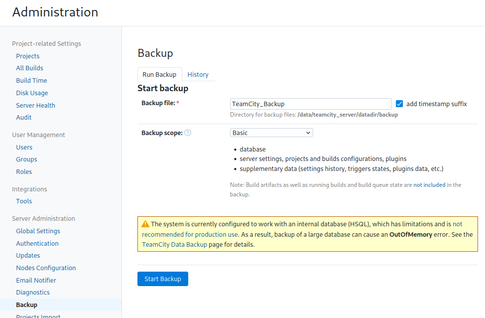

# Reconnaissance

```
root@kali:/home/clehen38# ifconfig 
eth0: flags=4163<UP,BROADCAST,RUNNING,MULTICAST>  mtu 9001
        inet 192.168.10.10  netmask 255.255.255.0  broadcast 192.168.10.255
        inet6 fe80::7a:c4ff:fea5:65a6  prefixlen 64  scopeid 0x20<link>
        ether 02:7a:c4:a5:65:a6  txqueuelen 1000  (Ethernet)
        RX packets 6707735  bytes 5647585020 (5.2 GiB)
        RX errors 0  dropped 0  overruns 0  frame 0
        TX packets 5829899  bytes 1239334133 (1.1 GiB)
        TX errors 0  dropped 0 overruns 0  carrier 0  collisions 0
```

<figure><figcaption></figcaption></figure>

IDENTIFICATION DES OS&#x20;

```

root@kali:/home/clehen38# nmap -O 192.168.10.0/24
Starting Nmap 7.91 ( https://nmap.org ) at 2023-09-13 07:56 UTC
Nmap scan report for 192.168.10.1
Host is up (0.00018s latency).
All 1000 scanned ports on 192.168.10.1 are filtered
MAC Address: 02:9C:CE:2B:62:FE (Unknown)
Too many fingerprints match this host to give specific OS details
Network Distance: 1 hop

Nmap scan report for 192.168.10.2
Host is up (0.00027s latency).
Not shown: 999 filtered ports
PORT   STATE SERVICE
53/tcp open  domain
MAC Address: 02:9C:CE:2B:62:FE (Unknown)
Warning: OSScan results may be unreliable because we could not find at least 1 open and 1 closed port
Device type: general purpose
Running (JUST GUESSING): Linux 3.X (88%)
OS CPE: cpe:/o:linux:linux_kernel:3
Aggressive OS guesses: Linux 3.10 - 3.13 (88%), Linux 3.8 (88%)
No exact OS matches for host (test conditions non-ideal).
Network Distance: 1 hop

Nmap scan report for 192.168.10.34
Host is up (0.00046s latency).
Not shown: 998 closed ports
PORT   STATE SERVICE
21/tcp open  ftp
22/tcp open  ssh
MAC Address: 02:4B:3A:77:7A:A4 (Unknown)
Device type: general purpose
Running: Linux 3.X
OS CPE: cpe:/o:linux:linux_kernel:3
OS details: Linux 3.10 - 3.13
Network Distance: 1 hop

Nmap scan report for 192.168.10.184
Host is up (0.00040s latency).
Not shown: 997 closed ports
PORT   STATE SERVICE
21/tcp open  ftp
22/tcp open  ssh
80/tcp open  http
MAC Address: 02:D4:AD:A4:81:62 (Unknown)
Device type: general purpose
Running: Linux 3.X
OS CPE: cpe:/o:linux:linux_kernel:3
OS details: Linux 3.10 - 3.13
Network Distance: 1 hop

Nmap scan report for 192.168.10.10
Host is up (0.000020s latency).
All 1000 scanned ports on 192.168.10.10 are closed
Too many fingerprints match this host to give specific OS details
Network Distance: 0 hops

OS detection performed. Please report any incorrect results at https://nmap.org/submit/ .
Nmap done: 256 IP addresses (5 hosts up) scanned in 13.66 seconds
root@kali:/home/clehen38# 
```

Vérification avec netcat


```
root@kali:/home/clehen38# nc 192.168.10.34 21
220 (vsFTPd 2.3.4)
^C
root@kali:/home/clehen38# nc 192.168.10.34 22
SSH-2.0-OpenSSH_6.6.1p1 Ubuntu-2ubuntu2.13
^C
root@kali:/home/clehen38# nc 192.168.10.184 80

HTTP/1.1 400 Bad Request
Date: Wed, 13 Sep 2023 08:22:18 GMT
Server: Apache/2.4.29 (Ubuntu)
Content-Length: 301
Connection: close
Content-Type: text/html; charset=iso-8859-1

<!DOCTYPE HTML PUBLIC "-//IETF//DTD HTML 2.0//EN">
<html><head>
<title>400 Bad Request</title>
</head><body>
<h1>Bad Request</h1>
<p>Your browser sent a request that this server could not understand.<br />
</p>
<hr>
<address>Apache/2.4.29 (Ubuntu) Server at 127.0.1.1 Port 80</address>
</body></html>
^C
root@kali:/home/clehen38#   
```
