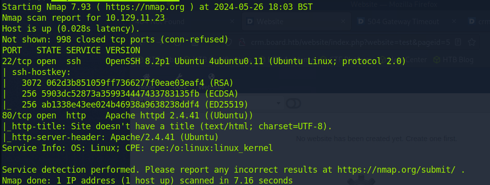

# Runner

10.129.3.138

<figure><figcaption></figcaption></figure>

ffuf -w /opt/useful/SecLists/Discovery/DNS/bitquark-subdomains-top100000.txt:FUZZ -u http://runner.htb/ -H 'Host: FUZZ.runner.htb' -fw 4

<figure><figcaption></figcaption></figure>

<figure><figcaption></figcaption></figure>



<figure><figcaption></figcaption></figure>

H454NSec9866:@H454NSec

<figure><figcaption></figcaption></figure>

<figure><figcaption></figcaption></figure>

<figure><figcaption></figcaption></figure>

<figure><figcaption></figcaption></figure>

on se co avec matthew qu'on a crack juste avant&#x20;

<figure><figcaption>
teamcity:latest
</figcaption></figure>

<figure><figcaption></figcaption></figure>

<figure><figcaption></figcaption></figure>

<figure><figcaption></figcaption></figure>
