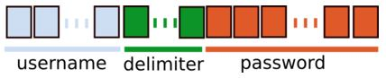

# Electronic Codebook encryption (ECB)

Si après multiples connexion a un site on continue d’avoir le même cookie, il y a surement kkch de louche.

Le cookie devrait être différent à chaque connexion. Cela signifie qu’il sera toujours valide et qu’il n’y a pas de check coté serveur avec la session.

Pour exploiter la faille d’une Encryption ECB il faudra trouver le délimiteur entre le User et le Password.



Ainsi nous allons volontairement créer 2 user :

* Le premiers avec une 20aine de 'a'
* le second avec 8 ‘a' suivi de 'admin’
* et un pass avec un grand nombre de 'b'

Ainsi apres les avoirs decodé nous pourrons retrouver les patterns et les exclure de la chaine pour garder uniquement le user ‘admin'.

On ré encode, on envoi le cookie et on est connecté.

Code Ruby pour décoder un cookie Url + base64

```
 irb
	> require 'base64' ; require 'uri'
	 => true
	> Base64.decode64(URI.decode_www_form_component("OR9hcp18%2BC1bChK10NlRRg%3d%3d"))
	 => "9\x1Far\x9D|\xF8-[\n\x12\xB5\xD0\xD9QF"
```

code Ruby pour encoder

```
% irb
	> require 'cgi'; require 'base64'
	 => true
	> CGI.escape(Base64.strict_encode64("\xE0Vd.)r\xEBz\aO\xC6d\x19\xE3+\xE3"))
	 => "4FZkLily63oHT8ZkGeMr4w%3D%3D"
```
