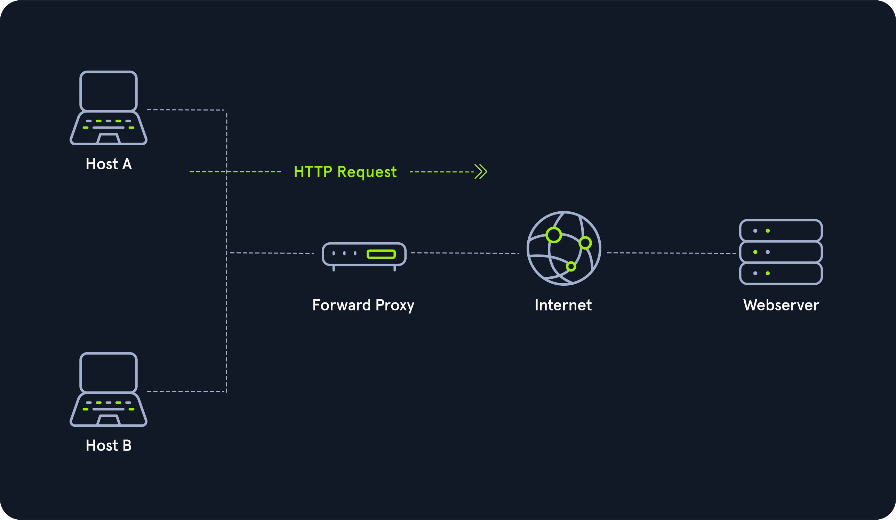

# Active Directory

**History** :  Introduced  in RFCs in 1971, predated by the X.500 and created by Novell and Lotus. Released in 1993 as Novell Directory Services.

AD came on Windows Server 2000 and Windows NT 3.0.

AD : Distributed, hierarchical. &#x20;

**Management Centralisé des ressources d'une organisation  comprennant :**&#x20;

* Utilisateurs&#x20;
* PC
* Groups
* Network Devices&#x20;
* Files Shares&#x20;
* Group policies&#x20;
* Devices&#x20;
* Trust&#x20;

**Forest**  :  Allows sysadmins to create "containers" of serparate domaines, users, computers and other object all under the same umbrella. **Active Directory Federation Services** (ADFS) was introduced in Server 2008 to provide **Single Sign-On** (SSO). Tree are collectioctions of AD trees.

**Group Managed Service Accounts** (gMSA) :  Came with Server 2016,offers a more secure way to run specific automated tasks, applications and services. (mitigation against the infamous Kerberoasting attack).

**Domain Controllers :** Handle auntenication requests, verify users on the networkand control access to various ressources.

**Active Directory Domain Services** (AD DS) : Ways to store Directory data and make it available to both standart users and administrators on the same network.&#x20;

**Domain** : Structure within which contaides objects ( users, compurters and groups) are accessible. it has many built-in **Organizational Units** (OUs), such as _Domain Controllers, Users, Computers_.New OUs can be created as required.&#x20;

```shell-session
INLANEFREIGHT.LOCAL/
├── ADMIN.INLANEFREIGHT.LOCAL
│   ├── GPOs
│   └── OU
│       └── EMPLOYEES
│           ├── COMPUTERS
│           │   └── FILE01
│           ├── GROUPS
│           │   └── HQ Staff
│           └── USERS
│               └── barbara.jones
├── CORP.INLANEFREIGHT.LOCAL
└── DEV.INLANEFREIGHT.LOCAL
```

**Object** : Any resource present within an Active Directory encironment such as Ous, printers, users, domain controllers, etc.

**Global Unique Identifier** (GUID) :  Unique 128-bit value assigned when a domain user or group is created. Every single object ceated by Active Directory is assigned a GUID.&#x20;

**Security principals** :  Anything that the operation system can autenticate, including users, computer, accounts, or even threads/processes that run in the context of a user or computer account.  In AD, security priciples are domain objects that can manage access to other resources within the domain.&#x20;

**Security identifier** (SID) :  Unique identifier for a security principal or security group. its issued by the domain controller and stored in a secure database. A SID can only be used once.&#x20;

**Distinguished Name** (DN) :  Describes the full path to an object in AD ( ex : cn = jzerbib, ou=INFRA, ou=Employé, dc=packsolutions, dc = local). Must be unique in the directory.&#x20;

**Relative Distinguished Name** (RDN) :  Single component of the DN that identifies the object as unique from other objects at the current level in the naming hierarchy.  Must be unique in an Organizational  Unit.

**sAMAccountName** : User's logon name. It must be a unique value and 20 or fewer characters.&#x20;

**userPrincipalName** :  Prefix (the user account name) and suffix (the domain name)  ex (bjones@inlanefreight.local). This attribute is not mandatory.&#x20;

**Flexible Single Master Operation** (FSMO)  :  Give Domain Controller (DC) the ability to continue authenticating users and granting permissions without interruption. There are five FMSO roles :  **Schema Master** and **Domain Naming Master** (one of each per forest), **Relative ID (RID) Master** ( one per Domain), **Primary Domain Controller (PDC) Emulator**  (one per Domain) and **Infrastructure Master** (one per domain).   All five roles are assigned to the first DC in the forest root domain in a new AD forest.&#x20;

**Global Catalog  :**  Domain controller that stores copies of ALL objects in an Active Directory forest.   full copy of all objects in the current domain and a partial copy of objects that belong to others forest. GC is a feature that is enablesd on a domain controller and performs  anthentication and object search.&#x20;

**Read-Only Domain Controller** (RODC)  : No AD account passwords are cached on an RODC. No changes are pushed via on RODC's Ad database, SYSVOL, or DNS. Also include read-onlu DNS server => reduce replication traffic in the encironment, and prevent SYSVOL modifications form being replicated to other DCs.&#x20;

**Replication** :  happens in AD when AD objects are updated and trasferred from one DC to another. Whenever a DC is added, connection objects are created to manage replication between them. These connections are made by the **Knowledge Conistency checker (KCC)** service.&#x20;

**Service Principal Name** (SPN) :  uniquely identifies a service instance. They are used by Kerberos authentication to associate an instance of a service with a logon account, allowing a client application to request the service to authenticate an account without needing to know the accont name.&#x20;

**Group Policy Object** (GPO) : Virtual collection of policy settings. Has a unique GUID. Can be applied to both user and computer objects.

**Access Control Entities** (ACEs) : Each [Access Control Entity (ACE)](https://docs.microsoft.com/en-us/windows/win32/secauthz/access-control-entries) in an ACL identifies a trustee (user account, group account, or logon session) and lists the access rights that are allowed, denied, or audited for the given trustee.

**Access Control List** (ACL)  :  An [Access Control List (ACL)](https://docs.microsoft.com/en-us/windows/win32/secauthz/access-control-lists) is the ordered collection of Access Control Entities (ACEs) that apply to an object.

**Discretionary Access Control List** (DACL)  : DACLs Define wich securit principles are granted or denied access to an object.  No DACL => Access Full ;  if DACL has no entries , the system will deny all access attempts.

**Fully Qualified Domain Name** (FQDN) : Complete name for a specific computer or host. Format : \[host name].\[domain name].\[tld]

**Tombstone** :  Container object in AD that holds deleted AD objects. When  an object  is deleted from AD, the object remains for a set period of time known as the **Tombstone Lifetime,** and the **isDeleted** attribute is set to TRUE.&#x20;

**AD Recycle Bin :** When enable, any deleted objects are preserved for a period of time.&#x20;

**SYSVOL** : folder, or share, stores copies of public files in the domain such as sustem policies, Group Policy Settings, logon/logoff scripts.  The contents of the SYSVOL folder are replicated to all DCs within the encironment using **File Replication Services (FRS)**&#x20;

**AdminSDHolder** : used to manage **ACLs** for members of built-in groups in AD marked as privileged.&#x20;

**adminCount** : Detemines wheter or not the **SDProp** process protects a user.&#x20;

**Active Directory Users and Computers (ADUC)** : GUI console for managing users, groups, computers and contacts in AD. Can be done via Powershell too.&#x20;

**ADSI Edit :** GUI tool used to manage objects in AD.&#x20;

**sIDHistory** : Attribute that holds any **SIDs** that an object was assigned previously.&#x20;

**NTDS.DIT  :** File  (The Heart of Active Directory). Stored on a **Domain Controller** at  **C:\Windows\NTDS\\**  its a database that stores AD data such as information about user and group objecrs, membershiip and **Password hashes.**&#x20;

**MSBROWSE** :  Microsoft networking Protocol to provide browsing services.  Deprecated. now its **Server Message Block** (SMB) and  **Common Internet File System** (CIFS).&#x20;

**Leaf Object :**  Cannot contain any other object within them ( users, contacts , printers, computers).

**Trusts :** used to etablish **forest-forest**  or **domain-domain**  authentication.

<figure><figcaption></figcaption></figure>

